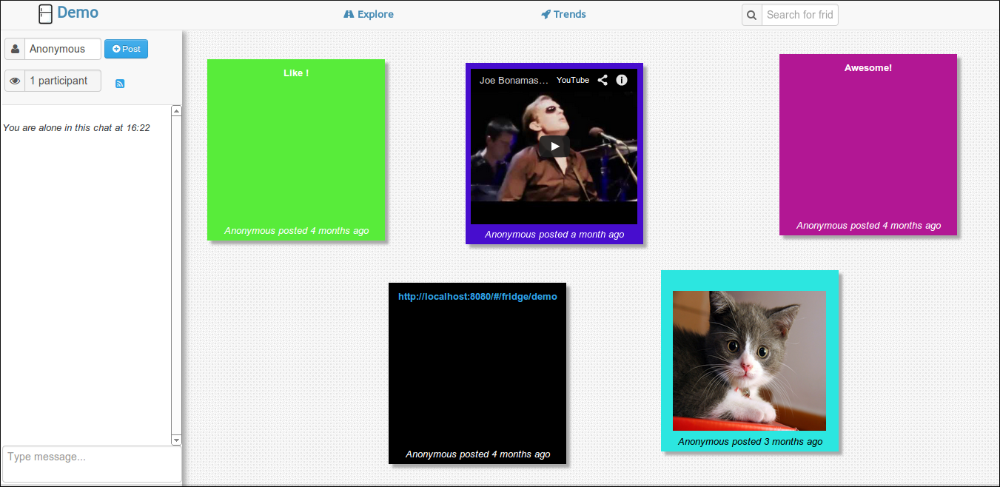

#post-on-my-fridge  

[Sticky notes shared in real time](http://fridges.arnaud-gourlay.info/)

This application focuses on realtime interactions and simplicity. 

The backend is written in Scala using [Akka](http://akka.io/) and [Spray](http://spray.io/). 

The frontend is a single page web app written with [Ember.js](http://emberjs.com/).

## Licence

Licensed under the Apache License, Version 2.0 (the "License"); you may not use this project except in compliance with the License. You may obtain a copy of the License at http://www.apache.org/licenses/LICENSE-2.0.

Unless required by applicable law or agreed to in writing, software distributed under the License is distributed on an "AS IS" BASIS, WITHOUT WARRANTIES OR CONDITIONS OF ANY KIND, either express or implied. See the License for the specific language governing permissions and limitations under the License.

Copyright &copy; 2014 **[Arnaud Gourlay](http://about.arnaud-gourlay.info/)**.

